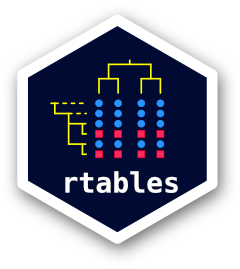

<!-- README.md is generated from README.Rmd. Please edit that file -->

```{r, echo = FALSE}
knitr::opts_chunk$set(
  collapse = TRUE,
  comment = "#>",
  fig.path = "man/figures/README-"
  )
suppressPackageStartupMessages(library(rtables))
suppressPackageStartupMessages(library(dplyr))
```

# rtables <a href='https://github.com/insightsengineering/rtables'></a>

[](https://travis-ci.org/insightsengineering/rtables/)


## Reporting tables with R

The `rtables` R package was designed to create and display complex tables with R. The cells in an `rtable` may contain
any high-dimensional data structure which can then be displayed with cell-specific formatting instructions. Currently,
`rtables` can be outputted in `ascii` `html`, and `pdf`, as well powerpoint (via conversion to `flextable` objects). `rtf` support is in development and will be in a future release.

`rtables` is developed and copy written by `F. Hoffmann-La Roche` and it is released open source under Apache
License Version 2. 

`rtables` development is driven by the need to create regulatory ready tables for health authority review. Some of the key requirements for this undertaking are listed below:

* cell values and their visualization separate (i.e. no string based tables)
  - values need to be programmatically accessible in their non-rounded state for cross-checking
* multiple values displayed within a cell
* flexible tabulation framework
* flexible formatting (cell spans, rounding, alignment, etc.)
* multiple output formats (html, ascii, latex, pdf, xml)
* flexible pagination in both horizontal and vertical directions
* distinguish between name and label in the data structure to work with CDISC standards
* title, footnotes, cell cell/row/column references

`rtables` currently covers virtually all of these requirements, and further advances remain under active development.


## Installation

`rtables` is now available on CRAN and you can install the latest released version with:

```r
install.packages("rtables")
```

or you can install the latest development version directly from GitHub with:

```r
remotes::install_github("insightsengineering/formatters")
remotes::install_github("insightsengineering/rtables")
```

Note you might need to set your `GITHUB_PAT` environment variable in order to be able to install from GitHub.

Packaged releases (both those on CRAN and those between official CRAN releases) can be
found in the [releases list](https://github.com/insightsengineering/rtables/releases)

## Usage

We first begin with a demographic table alike example and then show the creation of a more complex table.


```{r}
library(rtables)

lyt <- basic_table() %>%
  split_cols_by("ARM") %>%
  analyze(c("AGE", "BMRKR1", "BMRKR2"), function(x, ...) {
    if (is.numeric(x)) {
      in_rows(
        "Mean (sd)" = c(mean(x), sd(x)),
        "Median" = median(x),
        "Min - Max" = range(x),
        .formats = c("xx.xx (xx.xx)", "xx.xx", "xx.xx - xx.xx")
      )
    } else if (is.factor(x) || is.character(x)) {
      in_rows(.list = list_wrap_x(table)(x))
    } else {
      stop("type not supproted")
    }
  })

build_table(lyt, ex_adsl)
```


```{r}
library(rtables)
library(dplyr)

## for simplicity grab non-sparse subset
ADSL <- ex_adsl %>% filter(RACE %in% levels(RACE)[1:3])

biomarker_ave <- function(x, ...) {
     val <- if(length(x) > 0) round(mean(x), 2) else "no data"
     in_rows(
        "Biomarker 1 (mean)" = rcell(val)
     )
}

basic_table(show_colcounts = TRUE) %>%
  split_cols_by("ARM") %>%
  split_cols_by("BMRKR2") %>%
  split_rows_by("RACE", split_fun = trim_levels_in_group("SEX")) %>%
  split_rows_by("SEX") %>%
  summarize_row_groups() %>%
  analyze("BMRKR1", biomarker_ave) %>%
  build_table(ADSL)
```


# Acknowledgments

We would like to thank everyone who has made `rtables` a better project by providing feedback and improving examples & vignettes. The following list of contributors is alphabetical:

Maximo Carreras, Francois Collins, Saibah Chohan, Tadeusz Lewandowski, Nick Paszty, Nina Qi, Jana Stoilova, Heng Wang, Godwin Yung

## Presentations
### Advanced rtables Training
* Part 1 [Slides](https://docs.google.com/presentation/d/1ygQE9UaoXY6C_FiQLkiYtXB_OnkVbXvsMIY6_MQPbx0/edit?usp=sharing)
* Part 2 - Forthcoming

### RinPharma Workshop: Creating Submission-Quality Clinical Trial Reporting Tables in R with rtables 
* [Slides](https://docs.google.com/presentation/d/1t0098eh1b8_FaFfRoD7jhP1nxhLmjrJeD5X5MkmKC48)

### R Adoption Series

* [R Adoption Series presentation 2022](https://www.youtube.com/watch?v=1i6vOId2h4A)
* Slides: https://github.com/gmbecker/rtables_radoption_webinar (index.html)

### New (Current) Layouting and Tabulation Framework (v.0.3+)

* [useR!2020 Presentation (on v0.3.1.1) July 2020](https://www.youtube.com/watch?v=CBQzZ8ZhXLA)
