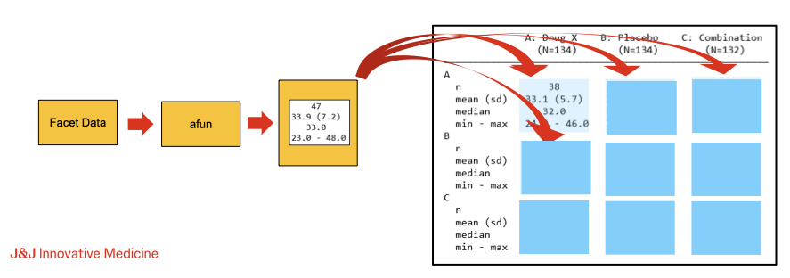

```{r, include = FALSE}
suggested_dependent_pkgs <- c("dplyr")
knitr::opts_chunk$set(
  collapse = TRUE,
  comment = "#>",
  eval = all(vapply(
    suggested_dependent_pkgs,
    requireNamespace,
    logical(1),
    quietly = TRUE
  ))
)
```

```{r, echo=FALSE}
knitr::opts_chunk$set(comment = "#")
```

# Analysis and Group Summary Function Review

During table creation, `rtables` calculates the contents for rows in
normal and marginal summary rows by calling analysis an group summary
functions, respectively, on the relevant facet data. Thus, while the
`split_row_by*` and `split_cols_by*` functions allow us to declare the
*structure* of our desired table, the `analyze` and
`summarize_row_groups` functions, via arguments `afun` and `cfun`,
respectively, allow us to declare the contents to appear in each
structural facet of our desired table.




Key points to recall about `a/cfun`s:

- First argument must be `x` or `df`
  - `x` will be passed a *facet data vector* for the variable (column) being analyzed/summarized
  - `df` will be passed the full *facet data frame* containing all columns of the data subset for the facet
- Can accept optional *special* arguments which will be populated by `rtables` during tabulation
  - Values of these arguments cannot currently be overrided by the user
- Can accept additional (non-*special*) arguments as desired
  - These can be passed via the `extra_args` argument to `analyze`/`summarize_row_groups`
- Should return the result of calling `in_rows` (a `RowsVerticalSection` object)
- Only difference between `afun`s and `cfun`s is that the latter must accept `labelstr` as the second argument
  - `labelstr` will be automatically populated with the label for the
    facet being summarized for a `cfun` and not passed to functions
    used as an `afun`
	

# General Analysis/Summary Function Structure

Due to the last key point listed above, we can template a function
that can be used as both an analysis and summary function:

```{r}

template_acfun <- function(x,
         labelstr = NULL,
         ## <optional special args>,
         ## <additional args>,
         ...) {
  if (is.null(labelstr)) {
    ## 'calculate' label(s) for afun-usage case
    lbl <- "cool label, bro"  
  } else {
    ## calculate label(s) from labelstr for cfun-usage case
    lbl <- labelstr
  }

  ## whatever calculations we want
  out <- rcell(sample(c("what?", "huh?", "eh?"), 1), format = "xx")

  ## return our value(s) via in_rows
  in_rows(.list = list(ok = out), .labels = c(ok = lbl))
}
```

We can then use this function in either capacity:

```{r}
lyt <- basic_table() |>
  split_cols_by("ARM") |>
  split_rows_by("STRATA1", split_fun = keep_split_levels(c("A", "B"))) |>
  summarize_row_groups("STRATA1", cfun = template_acfun) |>
  split_rows_by("SEX", split_fun = keep_split_levels(c("F", "M"))) |>
  summarize_row_groups("SEX", cfun = template_acfun) |>
  analyze("AGE", afun = template_acfun)

build_table(lyt, ex_adsl)
```

In light of the above, we will - without loss of generality - discuss
analysis functions exclusively for the remainder of this guide with
the exception of any situation where the difference is specifically
relevant.

# Arguments To Analysis Functions

Beyond `.spl_context`, which is covered in detail on its own in the next section of this guide, the special arguments (again: those that `rtables` will populate itself during tabulation) can be categorized into three rough, somewhat overlapping groups:

- Marginal Counts
- Facet Data
- Reference Group Information

## `afun` Special Arguments: Marginal Counts

Among special `afun` arguments supported by `rtables`, those which
supply marginal counts are the most straightforward. That said, some
care is warranted to ensure we understand the values our function will
receive, particularly in the cases of `.N_row` and `.N_total`, as we
will see.

#### Marginal Column and Row Counts (`.N_col` and `.N_row`)

`.N_col` will receive the column count - as understood by the
`rtables` machinery - for the individual column our analysis function
is currently being applied within. `.N_row` meanwhile, will receive a
row count of the facet data for the (full) row facet our function is
being applied to.

When an `alt_counts_df` is provided in the call to `build_table`
`.N_col` will receive a count calculated based on that data frame, the
same as the column counts which can be optionally displayed when
rendering our tables.

Unlike `.N_col`, however, `.N_row` will ***always receive a count
based on the primary data (`df`) passed to `build_table`***. Thus in
the common case of `df` being e.g., an `ADAE` dataset representing
individual events while `alt_counts_df` is the corresponding `ADSL`
dataset corresponding to subjects/patients, `.N_row` will receive a
count of *events*, while `.N_col` will receive a count of
*subjects*. This is due to the fact that `alt_counts_df` is required
to contain the variables necessary for all column splitting in our
layout, it *is not* required to contain all variables necessary for
the row splitting.


#### Other Marginal Count Special Argument

`.all_col_counts` will receive the full vector of individual column
counts regardless of which column our `afun` is operating within. Like
`.N_col`, these counts will be based on `alt_counts_df` when it is
specified within the call to `build_table`.

***It is not advised to use `N_total`.*** Its current implementation
effectively returns the sum of all column counts; while this will be
correct for tables with simple column structure, it does not take into
account partially or fully overlapping columns and will be incorrect
when those are present in the table structure. In the next chapter of
this guide we will use the split context (`.spl_context`) to derive a
robust equivalent to `.N_total` as a way of illustrating some of the
information the split context provides.


# Further Topics On Creating Custom Analysis Functions

  - [Structure-Conditional Behavior In `afun`s With
    `.spl_context`](./guided_advanced_afuns_spl_context.html) Creating
    `afun`/`cfun` behavior conditional on location within the table
    structure using `.spl_context` and other optional arguments.
  - [Calling Existing `afun`s Within Custom `afun`s](./guided_advanced_afuns_rowsverticalsection.html) Details
    about what `in_rows` returns and how we can use that to wrap or
    combine existing `afun`s or `cfun`s
  - [Useful Behavioral Building Blocks For Complex Custom
    `afun`s](./guided_advanced_afuns_building_blocks.html) Examples of
    prototypical behaviors which can be reused and combined when
    writing custom `afun`s
