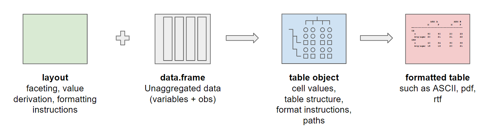

```{r, include = FALSE}
suggested_dependent_pkgs <- c("dplyr")
knitr::opts_chunk$set(
  collapse = TRUE,
  comment = "#>",
  eval = all(vapply(
    suggested_dependent_pkgs,
    requireNamespace,
    logical(1),
    quietly = TRUE
  ))
)
```
```{r, echo=FALSE}
knitr::opts_chunk$set(comment = "#")
```

## Introduction

The `rtables` package provides a framework to create, tabulate, and
output tables in R. Most of the design requirements for `rtables`
have their origin in studying tables that are commonly used to report
analyses from clinical trials; however, we were careful to keep
`rtables` a general purpose toolkit.

In this vignette, we give a short introduction into `rtables` and
tabulating a table.

The content in this vignette is based on the following two resources:

* The [`rtables` useR 2020 presentation](https://www.youtube.com/watch?v=CBQzZ8ZhXLA)
by Gabriel Becker
* [`rtables` - A Framework For Creating Complex Structured Reporting Tables Via
Multi-Level Faceted Computations](https://arxiv.org/pdf/2306.16610).

The packages used in this vignette are `rtables` and `dplyr`:

```{r, message=FALSE}
library(rtables)
library(dplyr)
```

## Overview

To build a table using `rtables` two components are required: A layout constructed
using `rtables` functions, and a `data.frame` of unaggregated data. These two
elements are combined to build a table object. Table objects contain information
about both the content and the structure of the table, as well as instructions on
how this information should be processed to construct the table. After obtaining the
table object, a formatted table can be printed in ASCII format, or exported to a
variety of other formats (`.txt`, `.pdf`, `.docx`, etc.).

```{r echo=FALSE, fig.align='center'}

```

## Data

The data used in this vignette is a made up using random number
generators. The data content is relatively simple: one row per
imaginary person and one column per measurement: study arm, the
country of origin, gender, handedness, age, and weight.

```{r data}
n <- 400

set.seed(1)

df <- tibble(
  arm = factor(sample(c("Arm A", "Arm B"), n, replace = TRUE), levels = c("Arm A", "Arm B")),
  country = factor(sample(c("CAN", "USA"), n, replace = TRUE, prob = c(.55, .45)), levels = c("CAN", "USA")),
  gender = factor(sample(c("Female", "Male"), n, replace = TRUE), levels = c("Female", "Male")),
  handed = factor(sample(c("Left", "Right"), n, prob = c(.6, .4), replace = TRUE), levels = c("Left", "Right")),
  age = rchisq(n, 30) + 10
) %>% mutate(
  weight = 35 * rnorm(n, sd = .5) + ifelse(gender == "Female", 140, 180)
)

head(df)
```

Note that we use factor variables so that the level order is
represented in the row or column order when we tabulate the
information of `df` below.

## Building a Table

The aim of this vignette is to build the following table step by step:

```{r, echo=FALSE}
lyt <- basic_table(show_colcounts = TRUE) %>%
  split_cols_by("arm") %>%
  split_cols_by("gender") %>%
  split_rows_by("country") %>%
  summarize_row_groups() %>%
  split_rows_by("handed") %>%
  summarize_row_groups() %>%
  analyze("age", afun = mean, format = "xx.xx")

tbl <- build_table(lyt, df)
tbl
```

## Quick Start

The table above can be achieved via the `qtable()` function. If you are new
to tabulation with the `rtables` layout framework, you can use this
convenience wrapper to create many types of two-way frequency tables.

The purpose of `qtable` is to enable quick exploratory data analysis. See the
[`exploratory_analysis`](https://insightsengineering.github.io/rtables/latest-tag/articles/exploratory_analysis.html) vignette for more details.

Here is the code to recreate the table above:
```{r}
qtable(df,
  row_vars = c("country", "handed"),
  col_vars = c("arm", "gender"),
  avar = "age",
  afun = mean,
  summarize_groups = TRUE,
  row_labels = "mean"
)
```

From the `qtable` function arguments above we can see many of the
key concepts of the underlying `rtables` layout framework.
The user needs to define:

 - Which variables should be used as facets in the row and/or column space?
 - Which variable should be used in the summary analysis?
 - Which function should be used as a summary?
 - Should the table include any marginal summaries?
 - Are any labels needed to clarify the table content?

In the sections below we will look at translating each of these questions
to a set of features part of the `rtables` layout framework. Now let's take a
look at building the example table with a layout.

## Layout Instructions

In `rtables` a basic table is defined to have 0 rows and one column
representing all data. Analyzing a variable is one way of adding a
row:

```{r}
lyt <- basic_table() %>%
  analyze("age", mean, format = "xx.x")

tbl <- build_table(lyt, df)
tbl
```

In the code above we first described the table and assigned that
description to a variable `lyt`. We then built the table using the
actual data with `build_table()`. The description of a table is called
a table layout. `basic_table()` is the start of every table layout and
contains the information that we have in one column representing all
data. The `analyze()` instruction adds to the layout that the `age`
variable should be analyzed with the `mean()` analysis function and
the result should be rounded to `1` decimal place.

Hence, a layout is "pre-data", that is, it's a description of how to
build a table once we get data. We can look at the layout isolated:

```{r}
lyt
```

The general layouting instructions are summarized below:

* `basic_table()` is a layout representing a table with zero rows and
  one column
* Nested splitting
  - in row space: `split_rows_by()`, `split_rows_by_multivar()`,
    `split_rows_by_cuts()`, `split_rows_by_cutfun()`,
    `split_rows_by_quartiles()`
  - in column space: `split_cols_by()`, `split_cols_by_multivar()`,
    `split_cols_by_cuts()`, `split_cols_by_cutfun()`,
    `split_cols_by_quartiles()`
* Summarizing Groups: `summarize_row_groups()`
* Analyzing Variables: `analyze()`, `analyze_colvars()`

Using those functions, it is possible to create a wide variety of
tables as we will show in this document.

## Adding Column Structure

We will now add more structure to the columns by adding a column split
based on the factor variable `arm`:

```{r}
lyt <- basic_table() %>%
  split_cols_by("arm") %>%
  analyze("age", afun = mean, format = "xx.x")

tbl <- build_table(lyt, df)
tbl
```

The resulting table has one column per factor level of `arm`. So the
data represented by the first column is `df[df$arm == "ARM A",
]`. Hence, the `split_cols_by()` partitions the data among the columns
by default.

Column splitting can be done in a recursive/nested manner by adding
sequential `split_cols_by()` layout instruction. It's also possible to
add a non-nested split. Here we splitting each arm further by the
gender:

```{r}
lyt <- basic_table() %>%
  split_cols_by("arm") %>%
  split_cols_by("gender") %>%
  analyze("age", afun = mean, format = "xx.x")

tbl <- build_table(lyt, df)
tbl
```

The first column represents the data in `df` where `df$arm == "A" &
df$gender == "Female"` and the second column the data in `df` where
`df$arm == "A" & df$gender == "Male"`, and so on.

More information on column structure can be found in the [`col_counts`](https://insightsengineering.github.io/rtables/latest-tag/articles/col_counts.html) vignette.

## Adding Row Structure

So far, we have created layouts with analysis and column splitting
instructions, i.e. `analyze()` and `split_cols_by()`,
respectively. This resulted with a table with multiple columns and one
data row. We will add more row structure by stratifying the mean
analysis by country (i.e. adding a split in the row space):

```{r}
lyt <- basic_table() %>%
  split_cols_by("arm") %>%
  split_cols_by("gender") %>%
  split_rows_by("country") %>%
  analyze("age", afun = mean, format = "xx.x")

tbl <- build_table(lyt, df)
tbl
```

In this table the data used to derive the first data cell (average of
age of female Canadians in Arm A) is where `df$country == "CAN" &
df$arm == "Arm A" & df$gender == "Female"`. This cell value can also
be calculated manually:

```{r}
mean(df$age[df$country == "CAN" & df$arm == "Arm A" & df$gender == "Female"])
```

Row structure can also be used to group the table into titled groups
of pages during rendering. We do this via 'page by splits', which are
declared via `page_by = TRUE` within a call to `split_rows_by`:

```{r}
lyt <- basic_table() %>%
  split_cols_by("arm") %>%
  split_cols_by("gender") %>%
  split_rows_by("country", page_by = TRUE) %>%
  split_rows_by("handed") %>%
  analyze("age", afun = mean, format = "xx.x")

tbl <- build_table(lyt, df)
cat(export_as_txt(tbl, page_type = "letter", page_break = "\n\n~~~~~~ Page Break ~~~~~~\n\n"))
```

We go into more detail on page-by splits and how to control the
page-group specific titles in the Title and footer vignette.

Note that if you print or render a table without pagination, the
page_by splits are currently rendered as normal row splits. This may
change in future releases.

## Adding Group Information

When adding row splits, we get by default label rows for each split
level, for example `CAN` and `USA` in the table above. Besides the
column space subsetting, we have now further subsetted the data for
each cell. It is often useful when defining a row splitting to display
information about each row group. In `rtables` this is referred to as
content information, i.e. `mean()` on row 2 is a descendant of `CAN`
(visible via the indenting, though the table has an underlying tree
structure that is not of importance for this vignette). In order to
add content information and turn the `CAN` label row into a content
row, the `summarize_row_groups()` function is required. By default,
the count (`nrows()`) and percentage of data relative to the column
associated data is calculated:

```{r}
lyt <- basic_table() %>%
  split_cols_by("arm") %>%
  split_cols_by("gender") %>%
  split_rows_by("country") %>%
  summarize_row_groups() %>%
  analyze("age", afun = mean, format = "xx.x")

tbl <- build_table(lyt, df)
tbl
```

The relative percentage for average age of female Canadians is
calculated as follows:

```{r}
df_cell <- subset(df, df$country == "CAN" & df$arm == "Arm A" & df$gender == "Female")
df_col_1 <- subset(df, df$arm == "Arm A" & df$gender == "Female")

c(count = nrow(df_cell), percentage = nrow(df_cell) / nrow(df_col_1))
```

so the group percentages per row split sum up to 1 for each column.

We can further split the row space by dividing each country by
handedness:

```{r}
lyt <- basic_table() %>%
  split_cols_by("arm") %>%
  split_cols_by("gender") %>%
  split_rows_by("country") %>%
  summarize_row_groups() %>%
  split_rows_by("handed") %>%
  analyze("age", afun = mean, format = "xx.x")

tbl <- build_table(lyt, df)
tbl
```

Next, we further add a count and percentage summary for handedness
within each country:

```{r}
lyt <- basic_table() %>%
  split_cols_by("arm") %>%
  split_cols_by("gender") %>%
  split_rows_by("country") %>%
  summarize_row_groups() %>%
  split_rows_by("handed") %>%
  summarize_row_groups() %>%
  analyze("age", afun = mean, format = "xx.x")

tbl <- build_table(lyt, df)
tbl
```

## Comparing with Other Tabulation Frameworks

There are a number of other table frameworks available in `R`, including:

* [gt](https://gt.rstudio.com/)
* [xtable](https://CRAN.R-project.org/package=xtable)
* [tableone](https://CRAN.R-project.org/package=tableone)
* [tables](https://CRAN.R-project.org/package=tables)

There are a number of reasons to choose `rtables` (yet another tables R package):

* Output tables in ASCII to text files.
* Table rendering (ASCII, HTML, etc.) is separate from the data
  model. Hence, one always has access to the non-rounded/non-formatted
  numbers.
* Pagination in both horizontal and vertical directions to meet the
  health authority submission requirements.
* Cell, row, column, and table reference system.
* Titles, footers, and referential footnotes.
* Path based access to cell content which is useful for automated
  content generation.

More in depth comparisons of the various tabulation frameworks can be found in the
[Overview of table R packages](https://rconsortium.github.io/rtrs-wg/tablepkgs.html#tablepkgs)
chapter of the Tables in Clinical Trials with R book compiled by the R Consortium
Tables Working Group.

## Summary

In this vignette you have learned:

* Every cell has an associated subset of data - this means that much of tabulation
  has to do with splitting/subsetting data.
* Tables can be described with pre-data using layouts.
* Tables are a form of visualization of data.

The other vignettes in the `rtables` package will provide more
detailed information about the `rtables` package. We recommend that
you continue with the
[`tabulation_dplyr`](https://insightsengineering.github.io/rtables/latest-tag/articles/tabulation_dplyr.html)
vignette which compares the information derived by the table in this
vignette using `dplyr`.
